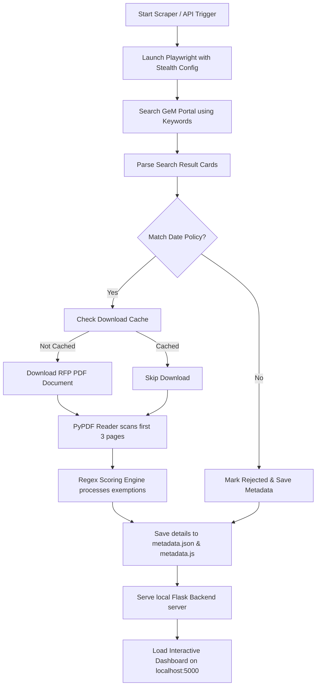

# 🛰️ GeMSentry


<div align="center">

**Smart RFP Acquisition & Scraper Dashboard for India's Government e-Marketplace (GeM)**

[](LICENSE)
[](https://www.python.org/)
[](https://playwright.dev/python/)
[](https://flask.palletsprojects.com/)

</div>

---

## 📌 Project Overview
**GeMSentry** is an automated pipeline and visual intelligence tool that monitors, extracts, parses, and scores RFP (Request for Proposal) documents from the India Government e-Marketplace (GeM) portal (`bidplus.gem.gov.in/all-bids`).

By leveraging headful/headless browser automation, PDF text analysis, and metadata scoring, GeMSentry takes the manual overhead out of bid hunting. It presents opportunities in a gorgeous, glassmorphic review dashboard with automated scoring and exemption analysis.

---

## 🛠️ Architecture Workflow

The following diagram illustrates how GeMSentry operates from keyword search to local dashboard rendering:



---

## ✨ Features

- **🛡️ Stealth Automation:** Uses Playwright with custom user agents, locale configurations, and anti-detection evasion scripts to bypass aggressive web application firewalls (WAF).
- **📋 Keyword Scouting:** Automatically queries keywords defined dynamically in your `config/keywords.csv` file.
- **📅 Dynamic Date Gates:** Automatically rejects tenders that are old or don't match the current month, ensuring you only focus on active bids.
- **🧠 Automated RFP Analyzer:** Automatically parses downloaded PDFs for critical details:
  - **EMD Amount:** Detects EMD presence and triggers warnings if it exceeds 10 Lakhs.
  - **Startup Exemption:** Identifies turnover/experience exemptions for startups.
  - **MSE Exemption:** Identifies micro & small enterprise exemptions.
  - **Pre-Bid Details:** Detects pre-bid meeting necessity and pulls scheduling dates.
  - **ePBG Details:** Identifies performance bank guarantee requirement percentages.
- **🖥️ Glassmorphic Triage Dashboard:** Sleek, responsive, local web interface featuring:
  - Global searching and keyword filtering.
  - Live console stream of scraping activities.
  - Quick buttons to override and toggle status (Shortlisted, Pending, Rejected).
  - One-click viewing of downloaded RFP documents.

---

## 🚀 Getting Started

### Quick Start (Windows)
We provide a PowerShell script that configures your virtual environment, updates dependencies, downloads Playwright chromium binaries, and starts the system:

```powershell
powershell -ExecutionPolicy Bypass -File .\run_search.ps1
```

### Manual Installation (Any OS)

1. **Clone the Repository:**
   ```bash
   git clone https://github.com/<your-username>/GeMSentry.git
   cd GeMSentry
   ```

2. **Install Dependencies:**
   ```bash
   uv sync            # or: pip install -e .
   ```

3. **Install Browser Binaries:**
   ```bash
   playwright install chromium
   ```

4. **Run the Application:**
   ```bash
   python run.py
   ```
   *The local server will spin up, and your default web browser will automatically open to `http://localhost:5000`.*

---

## 📁 Project layout

| Path | Purpose |
|------|---------|
| `config/` | Tunable knobs: `keywords.csv`, `scoring_config.json`, `company_profile.json` |
| `data/` | Runtime / imported state (`history.json`, optional `source/` inputs) |
| `logs/` | App log (`gemsentry.log`) + per-scrape session files under `logs/scrapes/` |
| `tenders/` | Tender metadata + downloaded RFP PDFs (`tenders/downloads/`) |
| `static/` | Dashboard CSS + JS, served separately so the browser caches them |
| `gemsentry/web/` | Flask blueprints (`auth`, `tenders`, `settings`, `live_excel`, `master_sheet`) + shared `context.py` |
| `gemsentry/db.py` | SQLite tender store (store of record) |
| `paths.py` | Single path map used by app, scraper, and tools |
| `app.py` | Composition root: builds the Flask app, registers blueprints |
| `run.py` | Primary entrypoint |

### Data storage

`tenders/<workspace>/metadata.db` (SQLite) is the store of record. `metadata.json`
and `metadata.csv` are **exports** kept beside it for `tools/` and for reading by
hand; they are refreshed on every bulk save and, after a single-record change, by
a debounced background writer. An existing `metadata.json` is migrated into the
database automatically on first run.

## Security

The server binds `127.0.0.1` by default. Binding any other interface requires an
auth token, and startup refuses otherwise:

```powershell
$env:GEMSENTRY_AUTH_TOKEN = "<a long secret>"
$env:GEMSENTRY_HOST = "0.0.0.0"
```

API calls authenticate with `Authorization: Bearer <token>`. The `HttpOnly`
cookie issued by `/api/auth/verify` covers browser navigations (opening a PDF)
and is deliberately **not** accepted for POST/PUT/PATCH/DELETE, so another site
cannot forge a state change.

Google Sheets sync settings live in `config/google_sync_config.json`, which is
gitignored. Copy `config/google_sync_config.example.json`, or set
`GEMSENTRY_APPS_SCRIPT_URL` / `GEMSENTRY_SHEET_ID` / `GEMSENTRY_MASTER_XLSX`.

## Development

```bash
uv sync --group dev
uv run pytest                 # test suite
uv run pytest --cov=gemsentry # with coverage
uv run ruff check .           # lint
```

---

## ⚙️ Configuration

### 🔍 Keywords Setup
Modify `config/keywords.csv` to add or remove search terms. GeMSentry will automatically pick these up on the next scrape.

Searches default to **Auto** pagination, following GeM's result count instead of stopping after two pages. A search has a five-minute budget and a 1,000-page safety ceiling; the console reports incomplete searches, repeated pages, and date/relevance exclusions. Select a fixed page limit for a quick scan. The API accepts up to 1,000 keywords and `max_pages: null` for Auto.

Capacity-specific discovery terms are broadened automatically (`250 KW SOLAR` → `SOLAR`, `12V 100AH BATTERY` → `BATTERY`). Profile phrases also use broader word queries, with relevance checked against listing content. Drone/UAV aliases share a search plan. Rediscovered bids refresh their closing dates and listing facts before scoring.

INR values preserve decimal places. To repair previously stored values from local PDFs, run `python tools/repair_bid_values.py` to preview corrections, then add `--apply`. Original records are backed up before updates; missing amounts are never repaired by guessing where a decimal belongs.
```csv
POWER SUPPLY
RADAR
SOFTWARE
MILITARY GRADE
```

### 🗓️ Date Policy Engine
The system uses strict filters inside `scraper.py` to triage tenders:
* **Start Date Rule:** Must match the current calendar month and year.
* **Duration Rule:** The bid duration (End Date - Start Date) must be at least 7 days.
* **Remaining Time Rule:** The time left to submit must be at least 7 days.

---

## 📚 References & Third-Party Libraries

GeMSentry uses several open-source libraries to deliver automation:
* **[Playwright Python API](https://playwright.dev/python/):** Drives headless browser operations and manages secure PDF downloading.
* **[Flask](https://flask.palletsprojects.com/):** Powers the local API server and serves the dashboard interface.
* **[BeautifulSoup 4](https://www.crummy.com/software/BeautifulSoup/):** Parses bid card structures from GeM search page results.
* **[PyPDF](https://pypdf.readthedocs.io/):** Handles local PDF text extraction to scan for exemptions and penalties.
* **[Government e-Marketplace (GeM)](https://gem.gov.in/):** The public procurement portal of India from which bids are aggregated.

---

## 📄 License

Distributed under the MIT License. See [LICENSE](LICENSE) for details.
